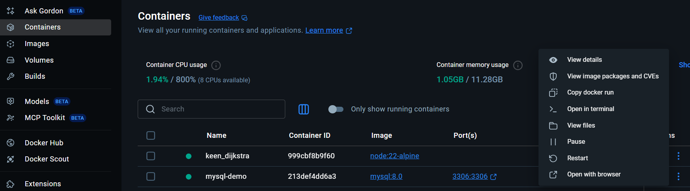

# LABORATORIOS DE BASE DE DATOS

## LABORATORIO 1 : Instalación de Gestor de base de datos
- Instalación de un servidor linux en docker desktop
```
docker run --name mysql-demo -e MYSQL_ROOT_PASSWORD=admin123 -p 3306:3306 -d mysql:8.0
```

- Conectarse a mysql a traves de la termina del docker
Ingresar a la terminal presionando los ...

<p align="center">

</p>

```
mysql -u root -p
```
Luego agregar la contraseña admin123

- Creación de usuario para gestionar la bd de forma remota
```
CREATE USER 'demo'@'%' IDENTIFIED WITH mysql_native_password BY 'demo123';
```
```
GRANT ALL PRIVILEGES ON \*.\* TO 'demo'@'%';
```
```
FLUSH PRIVILEGES;
```

- Instalar un front end y conectarse a la BD

🔹 1. MySQL Workbench (oficial de Oracle)

https://dev.mysql.com/downloads/workbench/

🔹 2. DBeaver (muy popular, open source)

https://dbeaver.io/download/

🔹 3. HeidiSQL (liviano y rápido)

https://www.heidisql.com/download.php

- Conexión al front end:

 - Host: 127.0.0.1
 - Port: 3306 (o el que expusiste en Docker).
 - User: demo
 - Password: demo123


## LABORATORIO 2 : Uso de base de datos
- Ejercicio con SQL
https://conclase.net/mysql/curso/cap12
